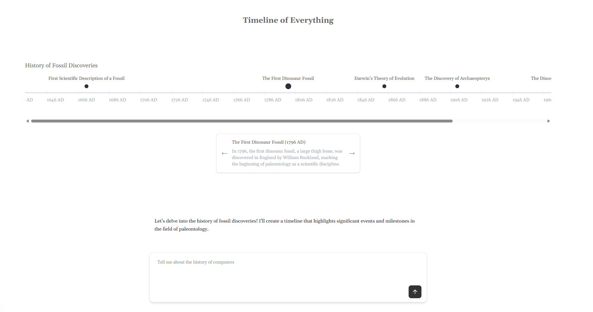

# The Timeline of Everything

Learn about the history of anything, visualized on a timeline to understand relative distance.



Uses [Tambo](https://tambo.co) to build a timeline of events based on an input message.

[Tambo](https://tambo.co) is a tool that lets you define and register your React components as UI tools that an LLM can use.

## Run locally

1. `npm install`

2. Rename `example.env.local` to `.env.local` and add your tambo key:

- `NEXT_PUBLIC_TAMBO_API_KEY`: Your Tambo API key. You can get a tambo API key for free [here](https://tambo.co/dashboard), or by running `npx tambo init`

Your `.env.local` file should look like this:

```
NEXT_PUBLIC_TAMBO_API_KEY=<your tambo api key>
```

3. Run `npm run dev` and go to `localhost:3000` to use the app!

## Customizing

### Change what components Tambo can use

The components or "UI tools" that Tambo can use are registered in `src/lib/tambo.ts`.

For example, see how the `Timeline` component is registered with tambo:

```tsx title="src/lib/tambo.ts"
export const components: TamboComponent[] = [
  {
    name: "Timeline",
    description:
      "A component that renders a horizontal timeline with events plotted along a time axis. Supports customizable year ranges, event labels, and tick intervals. Use this anytime somebody is asking you to tell them about something that happened in the past.",
    component: Timeline,
    propsSchema: z.object({
      title: z.string().describe("Title for the timeline"),
      events: z
        .array(
          z.object({
            year: z.number().describe("The year when the event occurred"),
            label: z.string().describe("Label text for the event"),
            description: z
              .string()
              .describe(
                "Description of the event. Should be around a paragraph."
              ),
          })
        )
        .describe("Array of events to display on the timeline"),
      tickInterval: z
        .number()
        .describe(
          "Interval between year ticks on the timeline to display (default: 5)"
        ),
    }),
  },
];
```

Note that the `component` field in the definition is a reference to the actual React component.

This list is passed to the `TamboProvider` component in `src/app/layout.tsx`:

```tsx title="src/app/layout.tsx"
<TamboProvider
  apiKey={process.env.NEXT_PUBLIC_TAMBO_API_KEY!}
  components={components}
>
  {children}
</TamboProvider>
```

Update the `components` array with any component(s) you want Tambo to be able to show.

You can find more information about the component registration options [here.](https://tambo.co/docs/concepts/registering-components)

#
